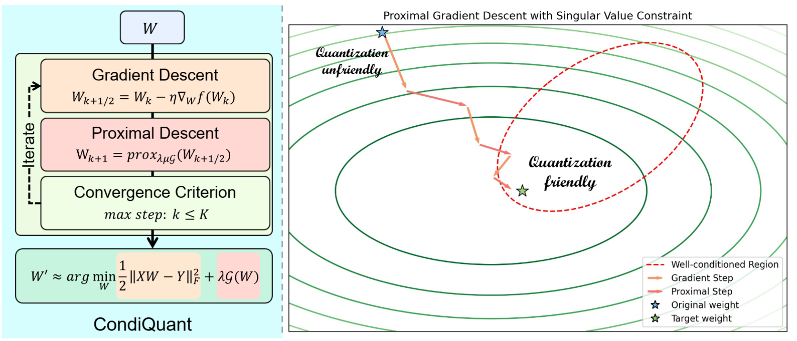
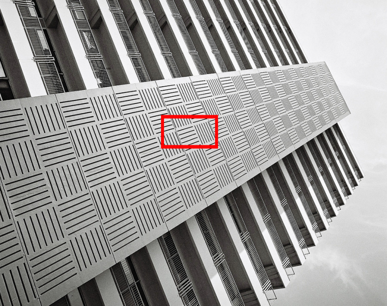
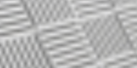
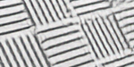
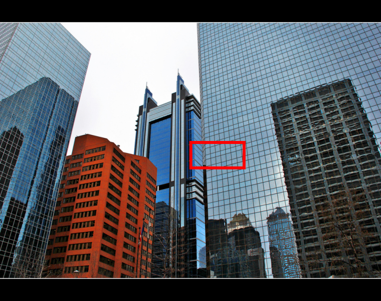
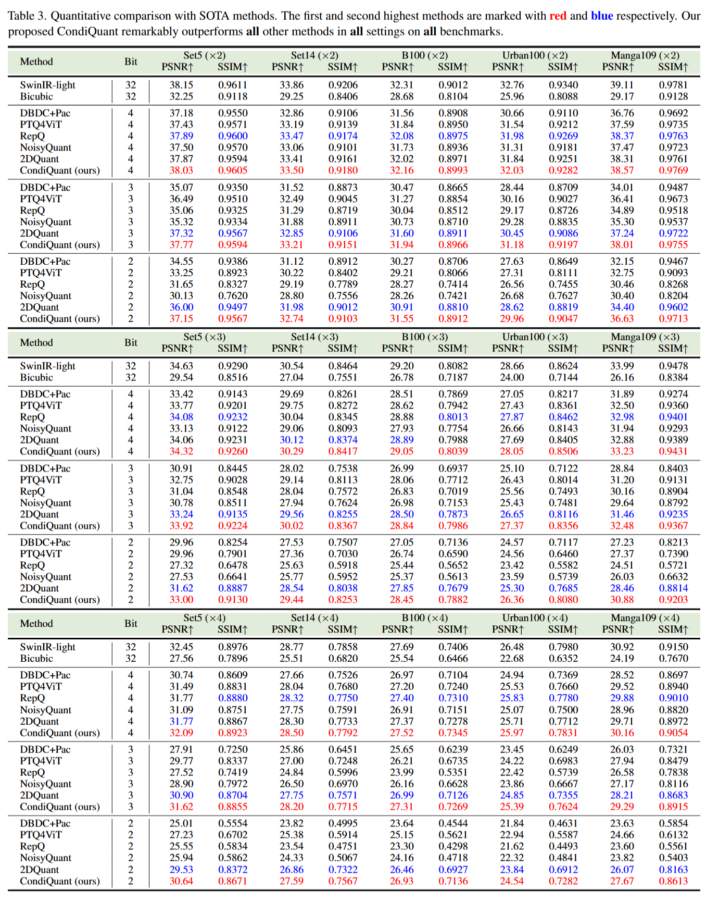
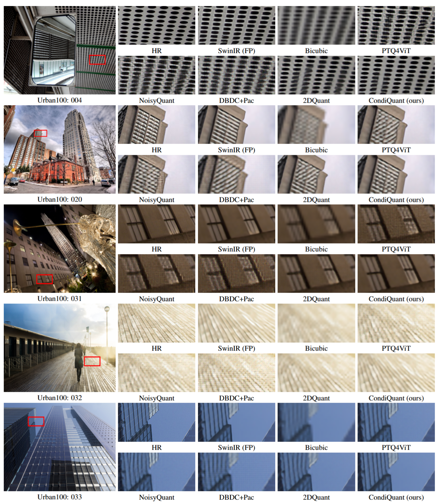

# BiMaCoSR: Binary One-Step Diffusion Model Leveraging Flexible Matrix Compression for Real Super-Resolution

[Kai Liu](https://kai-liu001.github.io/), [Dehui Wang](https://github.com/AAAtourist), [Zhiteng Li](https://zhitengli.github.io/), [Zheng Chen](https://zhengchen1999.github.io/), [Yong Guo](https://www.guoyongcs.com/), [Wenbo Li](https://fenglinglwb.github.io/), [Linghe Kong](https://www.cs.sjtu.edu.cn/~linghe.kong/), and [Yulun Zhang](http://yulunzhang.com/).

"CondiQuant: Condition Number Based Low-Bit Quantization for Image Super-Resolution", arXiv, 2025

[[arXiv]()] [[supplementary material]()] [visual results] [pretrained models]

#### 🔥🔥🔥 News

- **2025-02-16:** This repo is released.

---

> **Abstract:** *Low-bit model quantization for image super-resolution (SR) is a longstanding task that is renowned for its surprising compression and acceleration ability. However, accuracy degradation is inevitable when compressing the full-precision (FP) model to ultra-low bit widths (2~4 bits). Experimentally, we observe that the degradation of quantization is mainly attributed to the quantization of activation instead of model weights. In numerical analysis, the condition number of weights could measure how much the output value can change for a small change in the input argument, inherently reflecting the quantization error. Therefore, we propose CondiQuant, a condition number based low-bit post-training quantization for image super-resolution. Specifically, we formulate the quantization error as the condition number of weight metrics. By decoupling the representation ability and the quantization sensitivity, we design an efficient proximal gradient descent algorithm to iteratively minimize the condition number and maintain the output still. With comprehensive experiments, we demonstrate that CondiQuant outperforms existing state-of-the-art post-training quantization methods in accuracy without computation overhead and gains the theoretically optimal compression ratio in model parameters.* 

---



---

| Image | HR | Bicubic | [SwinIR(FP)](https://github.com/JingyunLiang/SwinIR) | [2DQuant](https://github.com/Kai-Liu001/2DQuant)  | CondiQuant (ours) |
| :--: | :--: | :--: | :--: | :--: | :--: |
|  |  |  |  |  |  |
|  |  |  |  |  |  |

---

## 🔖 TODO

- [ ] Release datasets.
- [ ] Release models.
- [ ] Release training and testing code.
- [ ] Release pre-trained CondiQuant.

## 🔗Contents

1. [Datasets](#Datasets)
2. [Models](#Models)
3. [Training](#Training)
4. [Testing](#Testing)
5. [Results](#Results)
6. [Citation](#Citation)
7. [Acknowledgements](#Acknowledgements)


---

<!-- ## 📦Datasets

The datasets will be provided soon.

## Models

The pre-trained model will be provided soon.

## Training

The training code will be provided soon.

## Testing

The testing code will be provided soon. -->

## 🔎Results

We achieve state-of-the-art performance. Detailed results can be found in the paper. All visual results of BiMaCoSR will be provided soon.

<details>
<summary>Click to expand</summary>

- results in Table 3 of the main paper

<p align="center">
  
</p>


- visual comparison (x4) in the main paper

<p align="center">
  
</p>


- visual comparison (x4) in the supplementary material

<p align="center">
  
  
</p>
</details>

## 📎Citation

If you find the code helpful in your research or work, please cite it!

```
@article{liu2025condiquant,
    title={CondiQuant: Condition Number Based Low-Bit Quantization for Image Super-Resolution},
    author={Liu, Kai and Wang, Dehui and Li, Zhiteng and Chen, Zheng and Li, Wenbo and Guo, Yong and Zhang, Yulun},
    journal={arXiv preprint arXiv:25xx.xxxx},
    year={2025}
}
```

## 💡Acknowledgements

This code is built on [BasicSR](https://github.com/XPixelGroup/BasicSR).